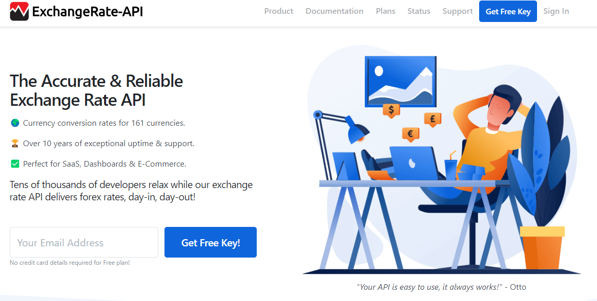
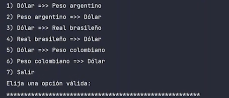
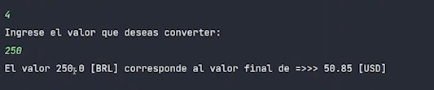

# Conversor-de-Moneda
Conversor de modeda consumiendo una API, Challenge Oracle ONE Nex Education G6
by [*@inglaph*](https://github.com/Inglaph) 
**Oracle ONE Next Education G6**  
*2024*

___
## Tabla de Contenido

- [Conversor-de-Moneda](#conversor-de-moneda)
  - [Tabla de Contenido](#tabla-de-contenido)
  - [Planteamiento del requerimiento](#planteamiento-del-requerimiento)
  - [Desarrollo de la Solución](#desarrollo-de-la-solución)
    - [Características](#características)
      - [Tecnologías Utilizadas](#tecnologías-utilizadas)

___
## Planteamiento del requerimiento
* Se desea realizar una aplicacion sencilla en JAVA que consuma la API [ExchageRate-API](https://www.exchangerate-api.com/).
  

* tenga un menu por consola con las siguientes opciones.

* solicite el monto a convertir segun la opcion seleccionada y retorne el valor convertido

## Desarrollo de la Solución

### Características
* Se realiza **App** minimalista en java, que cumple con el requerimiento, se utilizo un endpoint indicado en la API que devuelve el [Pair Conversion Requests](https://www.exchangerate-api.com/docs/pair-conversion-requests) de una moneda base y la tasa de conversion de una segunda moneda indicada en la misma **request**
* Utilizo la libreria **Gson** para recibir los datos **JSON** y crear los objetos que reciben la informacion
* El *paradigma* de programacion implementado es **PO**

#### Tecnologías Utilizadas
- **JAVA** Lenguaje de programacion
- **IntelliJ IDEA 2024.1(Community Edition)** IDE

---